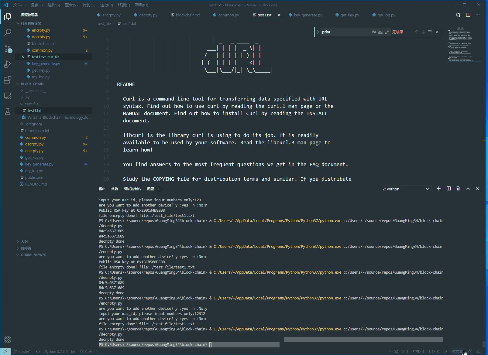

- - -
# 解决Python Crypto插件无法import问题
https://blog.csdn.net/Dennisqt/article/details/103927307

# python安装pycrypto包步骤及语法错误处理
## link
https://jingyan.baidu.com/article/95c9d20d7784ebec4f75616e.html
## error
		Windows系统Python 3.6.1 在安装pycrypto的过程中报错如下
		error C2061: 语法错误: 标识符“intmax_t”；
		error C2059: 语法错误:“;” ；
